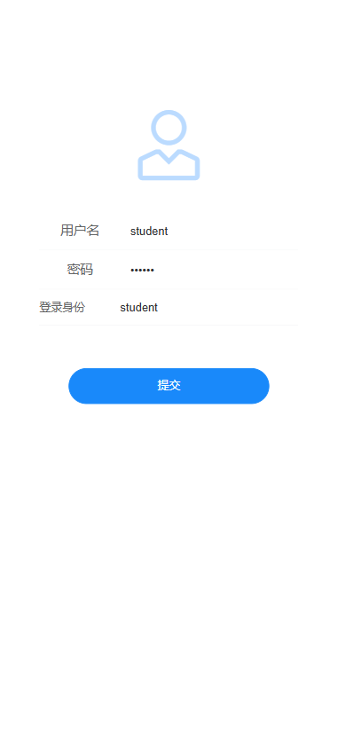
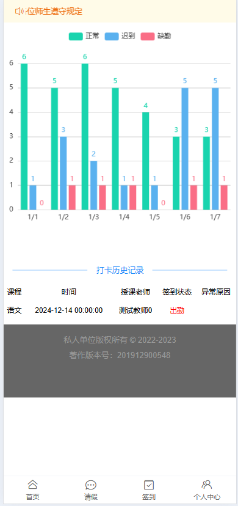
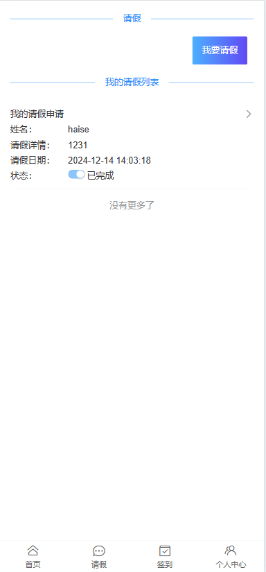

# 学生考勤管理系统前台页面
```
用于学生和教师登录，登录后查看自己的考勤情况，学生可以打卡，教师发布签到任务。
```
# 前台页面
## 登录


## 首页


## 签到


# 请假


# 个人页面


## 项目启动教程,先安装包 Project setup
```
npm install
```

### 启动服务 Compiles and hot-reloads for development
```
npm run serve
```

### Compiles and minifies for production
```
npm run build
```

### Lints and fixes files
```
npm run lint
```

### Customize configuration
See [Configuration Reference](https://cli.vuejs.org/config/).
